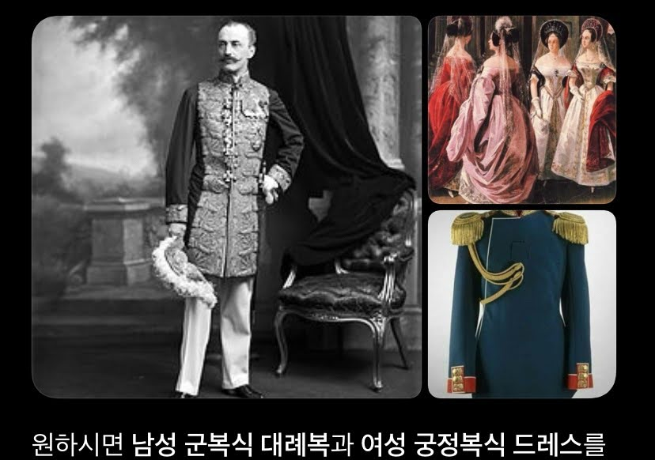
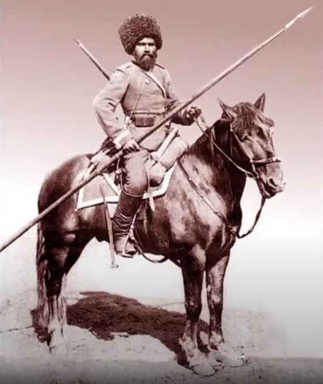
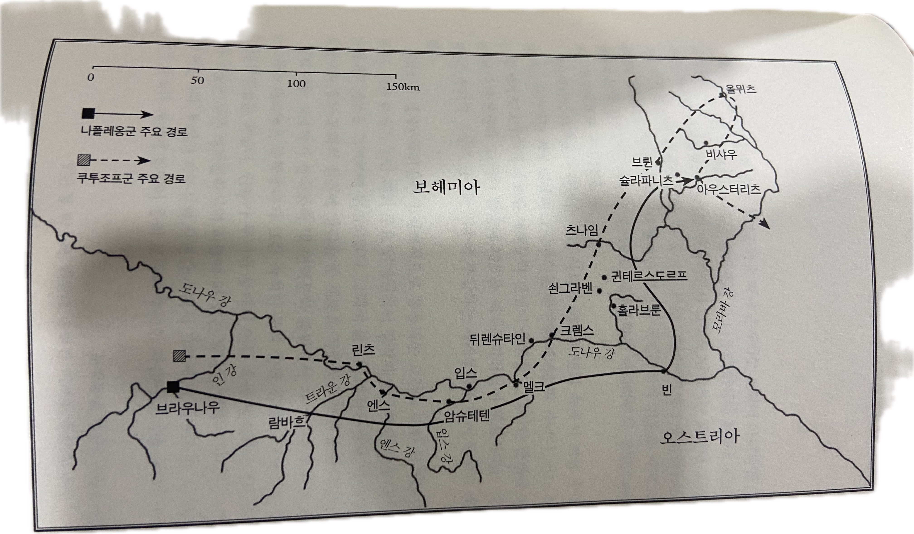
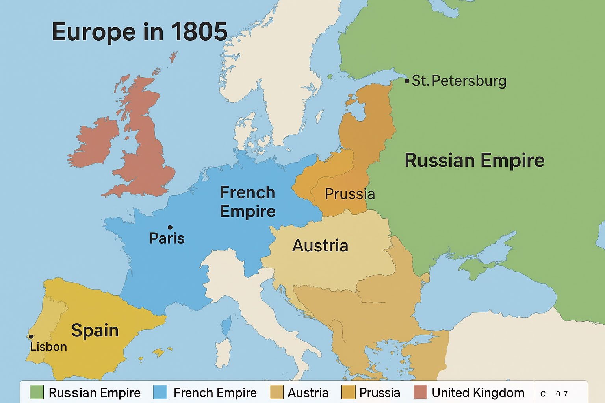

# 러시아 문학에서의 용어정리

## 대례복


## 카자크
* 카자크 외투
* 카자크 : 말탄 사람 이미지



## 1권_전쟁지도


## 당시 지도



## 사라판

https://i.namu.wiki/i/b8OBGsUPCr8Qoea-M5Y9cRO1v5FjCZ96ZBxvvURyVKfev4yAXLUIfYPkTztONeJf63UCHEzVRjNA7WvYZNuDlA.webp


펠트 외투
양가죽 모자

## 카포트
* www.151ril.com/content/gear/uniforms/16

논공행상


# 전쟁과 평화 속 전사들의 유형 정리

카자크에서 용기병, 드라군, 머스킷까지

⸻

1. 카자크 (Cossack)
	•	정규군이 아닌 반자치 전사 집단
	•	제국의 명령을 따르지만 자연과 하나 된 자유인으로 묘사됨
	•	말을 잘 타고 약탈과 매복에 능숙함
	•	톨스토이에게는 문명과 이성을 벗어난 본능적 인간상
	•	귀족 장교들과 대조적으로 전쟁의 현실을 대표함

핵심 요약
자유롭고 규범 밖에서 살아가는 전사, 톨스토이의 이상적 인간형

⸻

2. 용기병 (Dragoon)
	•	말을 탄 보병으로, 이동은 말을 이용하지만 전투는 내려서 총으로 함
	•	기동성과 화력을 겸비한 다목적 병사
	•	화려한 돌격보다 진흙 속 현실적인 전투를 수행
	•	귀족 장교의 명예보다 생존에 초점을 맞춘 전사상

핵심 요약
이름은 기병이지만 실상은 보병, 전쟁의 현실을 상징

⸻

3. 드라군 (StarCraft)
	•	스펠링은 역사 속 Dragoon과 동일
	•	기동성과 전투력의 융합 개념을 SF적으로 재해석
	•	프로토스 전사의 의식을 기계 몸에 옮긴 존재
	•	전통적인 전사정신과 미래적 기술의 결합체

핵심 요약
죽어도 싸움을 멈추지 않는 전사, 드라군의 상징은 불굴의 투혼

⸻

4. 머스킷 (Musket)
	•	16세기부터 19세기까지 사용된 전장식 장총
	•	총구에 화약과 탄환을 넣어 사용하는 느린 장전 방식
	•	정확도가 낮아 병사들이 일제 사격으로 싸움
	•	전쟁과 평화의 병사들은 이 무기로 싸우며 창검으로 돌격하기도 함

핵심 요약
느리고 혼란스러운 전장의 상징, 인간적 비극의 도구

⸻


| 구분 | 주요 특징 | 무기 | 역할 |
|------|------------|------|------|
| 기병 (Cavalry) | 말을 타고 돌격 | 창, 검 | 돌격 및 추격 |
| 용기병 (Dragoon) | 말로 이동, 보병처럼 전투 | 머스킷, 검 | 다목적, 기동 보병 |
| 경기병 (Light Cavalry) | 정찰, 교란, 추격 | 가벼운 검, 권총 | 빠른 정찰 |
| 중기병 (Heavy Cavalry) | 정면 돌격 | 중갑, 중검 | 돌격의 핵심 전력 |


# 트로이 신화 연관 표현
```
그는 갑자기 왠지 모르게 부끄러워졌다. 모두의 관심을 독차 지하고, 남들 눈에 자기가 행운아로 비치고 있는 것이, 잘생기지도 않 은 자기가 마치 헬레네를 손에 넣은 파리스 같다는 것이 쑥스러웠다.
```
