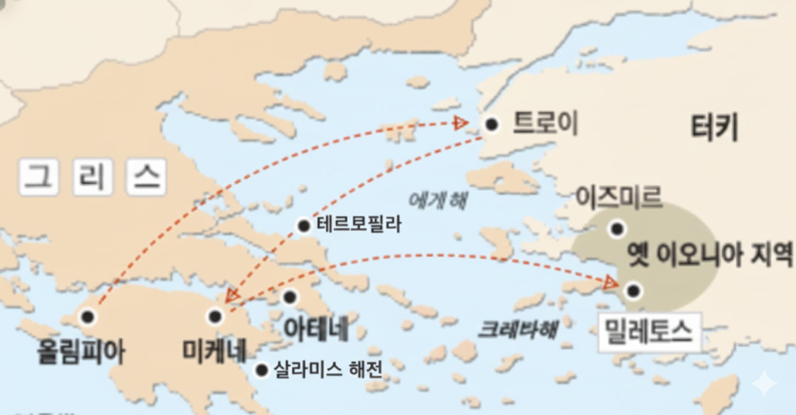

크로이소스

https://ko.wikipedia.org/wiki/%ED%81%AC%EB%A1%9C%EC%9D%B4%EC%86%8C%EC%8A%A4

## 🏛️ 고대 그리스 문명 연표 및 페르시아 전쟁 기록

### 📅 문명 연표

* **BC 2000 ~ 1600:** 크레타 문명
* **BC 1600 ~ 1200:** 미케네 문명 (그리스, 아테네인, 아카이아인)
* **BC 1200 ~ 800:** 도리아인 유입 (스파르타 역사의 암흑기)
* **BC 800 ~:** 폴리스 문명 개화 (아테네 - 군수, 무역, 해군 중심)
* **BC 490 ~:** 페르시아 전쟁 발발

---

### ⚔️ 테르모필라이 지형적 특징

테르모필라이 서쪽에는 오르기 힘든 높고 험준한 산이 있고 이것이 멀리 오이테 산으로 이어집니다. 그 동쪽은 바다와 인접해 있으며 소택지로만 가득 차 있습니다.

트라키아령을 지나 그리스로 들어오는 길은 테르모필라이의 전면과 후면에서는 **겨우 수레 한 대**밖에 지나가지 못할 정도로 좁습니다. 그래서 페르시아군이 이곳에서는 대부대를 움직일 수도, 기병 부대를 이용할 수도 없으리라 생각되었습니다.

---

### 🛡️ 페르시아 아시아 동맹 병력 규모 (헤로도토스 추산)

페르시아 육해군 부대는 다음과 같이 구성되었습니다.

#### 🚢 해상 부대 총 병력: 517,610명

* **본래 승무원:** 총 1,207척 $\times$ 200명/척 = **241,400명**
* **전투원 (페르시아인, 메디아인, 사카이인 등):** 총 1,207척 $\times$ 30명/척 = **36,210명** (추가)
* **오십노선 승무원:** 총 3,000척 $\times$ 80명/척 (평균) = **240,000명**

#### 🚶 육상 부대 병력

* **보병 부대:** **170만 명**
* **기병 부대:** **8만 명**
* **낙타/전차 부대 (아라비아인, 리비아):** **2만 명**
* **육해 양군 총병력 수 (아시아):** **2,317,610명** (수행하는 종복, 식량 수송선 승무원 등은 미포함)

#### 🌐 유럽 징발 부대 추가

* **해군:** 트라키아 및 인근 섬의 그리스인이 제공한 선박 120척 (승무원 수 24,000명 예상)
* **보병:** 트라키아인, 파이오니아인, 에오르도이인, 보티아이아인, 칼키디케 부족들, 브리고이인, 피에리아인, 마케도니아인, 페라이비아인, 에니아네스인, 돌로페스인 등.

> **총계:** 264만 명 + 비전투원 = **528만 3,220명**

---

### ⚔️ 그리스 연합군 진용 (테르모필라이)

이곳에서 페르시아 왕이 오길 기다리던 그리스군의 진용은 대략 **6,000명** 수준이었습니다.

* **스파르타:** 중무장병 300명
* **아르카디아:**
    * 테게아와 만티네이아: 각각 500명씩 (합계 1,000명)
    * 오르코메노스: 120명
    * 그 밖의 도시들: 1,000명 (코린토스 400명, 플레이우스 200명, 미케네 80명 포함)
* **보이오티아:**
    * 테스피아인: 700명
    * 테베인: 400명
* **구원 요청 응답 병력:**
    * 로크리스 오푼티아 지구: 전 병력
    * 포키스인: 1,000명

> **레오니다스** (스파르타 왕, 연합군 총지휘관)